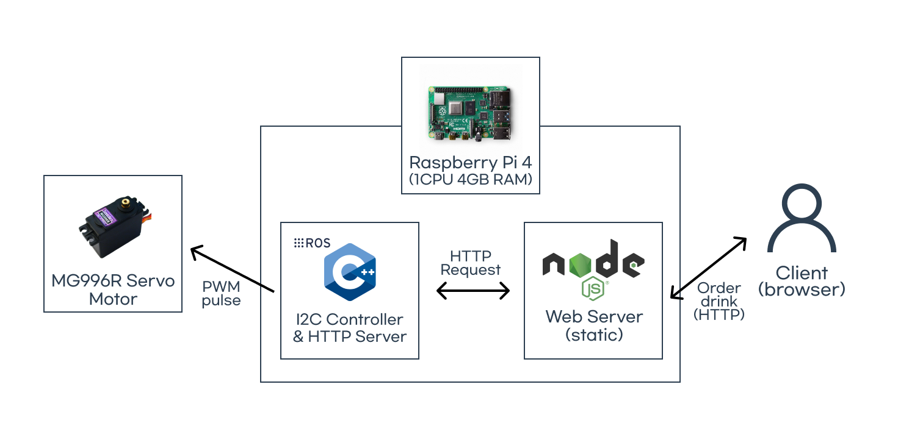

# Bartender Robot



## Overview

### Nodes
- `API Server`: Provides HTTP API for robot status and control
- `Dynamixel Controller`: Controls Dynamixel motors based on received commands
- `Keyboard Teleop`: Simple keyboard teleoperation for testing
- `Joint State Publisher`: Publishes joint states (for simulation)
- `Robot State Publisher`: Publishes robot state to TF (for simulation)
- `RViz`: Visualization tool


## Getting started

0. Install System dependencies (see below)

1. Build the workspace

    ```bash
    # Source ROS 2 installation(adjust for your ROS 2 distribution)
    $ source /opt/ros/humble/setup.bash

    # Source if you have MoveIt 2 workspace
    $ source ~/ws_moveit2/install/setup.bash

    $ cd bartender_robot
    
    # Clean previous builds
    $ rm -rf log build install
    
    $ colcon build --symlink-install
    ```

2. Source the workspace overlays

    ```bash
    $ source install/setup.bash
    ```

3. View the robot in RViz

    Starts the `robot_state_publisher` ans `joint_state_publisher(optional)`, and opens RViz:

    ```bash
    $ ros2 launch bartender_robot rviz.launch.py
    ```

4. Spawn the robot in Gazebo

    ```bash
    $ ros2 launch bartender_robot gz_sim.launch.py
    ```

5. Control real Dynamixel motors

    **Important**: Before running, make sure to:
    - Connect Dynamixel motors via USB (e.g., U2D2)
    - Set correct device name in launch file (default: `/dev/ttyUSB0`)
    - Configure correct Dynamixel IDs in launch file
    - Give permission to the USB port: `sudo chmod 666 /dev/ttyUSB0`

    ```bash
    # Bind Joint IDs with Real Dynamixel IDs
    $ ros2 run bartender_robot bartender_robot --ros-args \
      -p use_dynamixel:=true \
      -p joints:="['XL_430_base_Revolute-29','XL_430_shoulder_Revolute-30','XL_430_upper_Revolute-31','XL_430_lower_Revolute-32']" \
      -p dynamixel_ids:="[1,2,3,4]"

    # Or launch with more parameters
    $ ros2 run bartender_robot bartender_robot --ros-args \
      -p use_dynamixel:=true \
      -p joints:="['XL_430_base_Revolute-29','XL_430_shoulder_Revolute-30','XL_430_upper_Revolute-31','XL_430_lower_Revolute-32']" \
      -p dynamixel_ids:="[1,2,3,4]" \
      -p baud_rate:=57600 \
      -p step:=0.5
    ```

## System dependencies

Install ROS 2 Humble according to the official instructions:  
(or your desired ROS 2 distribution)
https://docs.ros.org/en/humble/Installation.html  

Install the packages below if they are not already available:  
(adjust for your ROS 2 distribution)

```bash
$ sudo apt update

# Install Dynamixel SDK
$ sudo apt-get install ros-$ROS_DISTRO-dynamixel-sdk

# Install sensor_msgs for joint states
$ sudo apt install ros-$ROS_DISTRO-sensor-msgs

# Install basic robot state publisher and RViz
$ sudo apt install \
    ros-$ROS_DISTRO-xacro \
    ros-$ROS_DISTRO-joint-state-publisher \
    ros-$ROS_DISTRO-joint-state-publisher-gui \
    ros-$ROS_DISTRO-robot-state-publisher \
    ros-$ROS_DISTRO-rviz2

# Install Gazebo and ROS-Gazebo bridge
$ sudo apt install \
    ros-$ROS_DISTRO-ros-gz \
    ros-$ROS_DISTRO-ros-gz-sim \
    ros-$ROS_DISTRO-ros-gz-bridge \
    ros-$ROS_DISTRO-ros2-control \
    ros-$ROS_DISTRO-ros2-controllers \
    ros-$ROS_DISTRO-gz-ros2-control

# Install MoveIt 2 (optional, for motion planning)
$ sudo apt install ros-$$ROS_DISTRO-moveit-configs-utils
```

### Dependencies
- [CMake](https://cmake.org/)
- [nlohmann_json](https://github.com/nlohmann/json)
- [cpp-httplib](https://github.com/yhirose/cpp-httplib)

### Note
<details>
<summary><b>USB settings for WSL2</b></summary>
If you are using WSL2, you may need to set up USB passthrough to access the Dynamixel motors. <a href="https://learn.microsoft.com/ko-kr/windows/wsl/connect-usb">Instructions Link</a>

1. Install `usbipd-win` on Windows:
    https://github.com/dorssel/usbipd-win/releases

2. Bind and attach USB device to WSL2:
    ```powershell
    # List available USB devices
    usbipd list

    # Bind the desired USB device (replace '1-2' with your device's bus ID)
    usbipd bind --busid 1-9

    # Attach the USB device to WSL
    usbipd attach --wsl --busid 1-9
    ```

3. Verify USB device is available in WSL2:
    ```bash
    lsusb
    ```
</details>